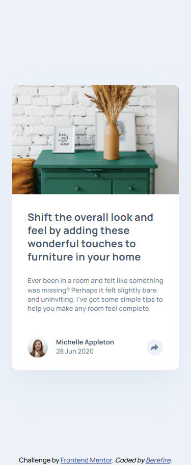
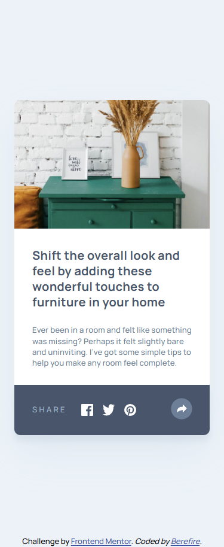
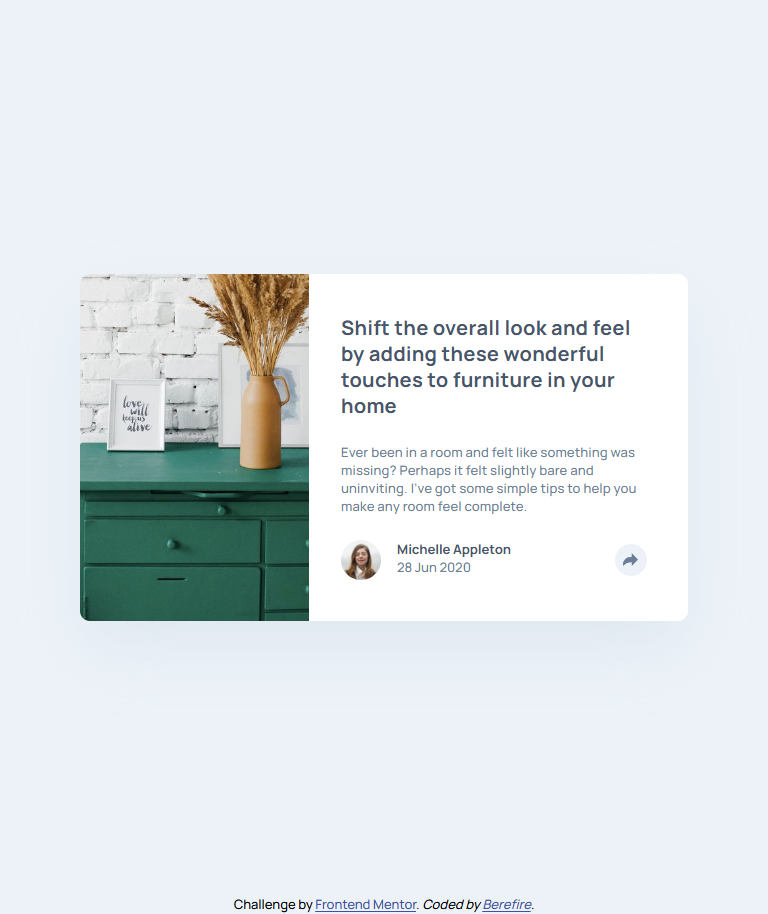
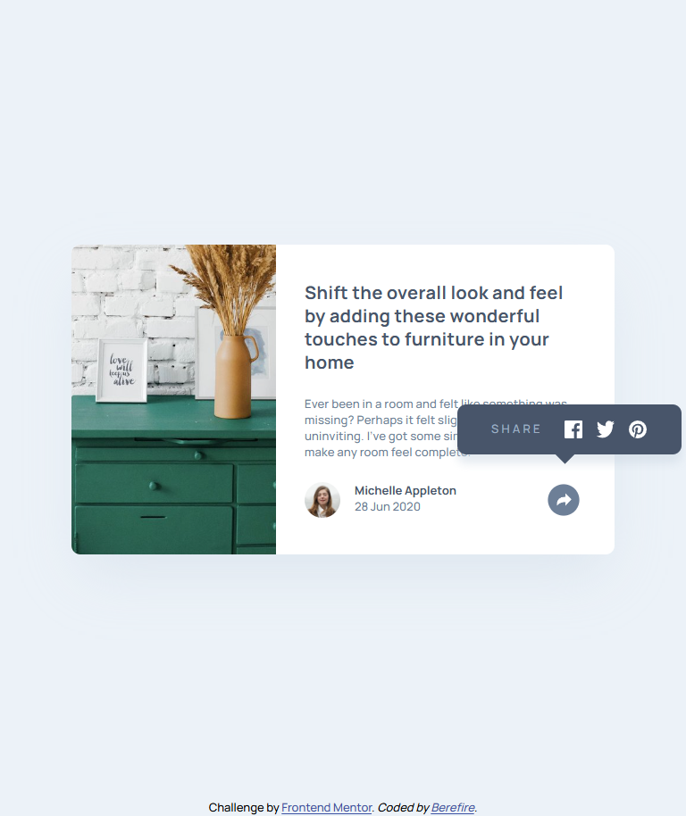
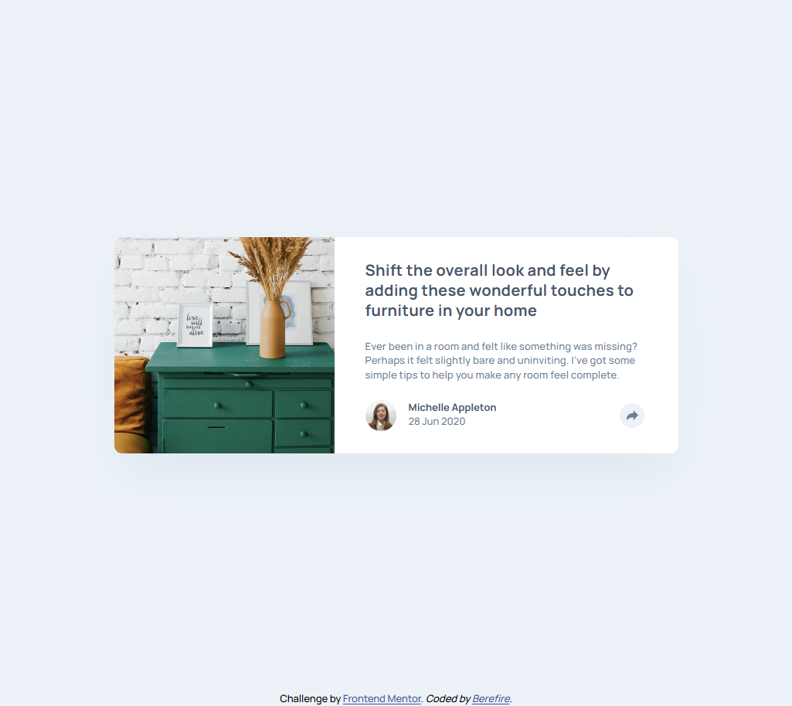
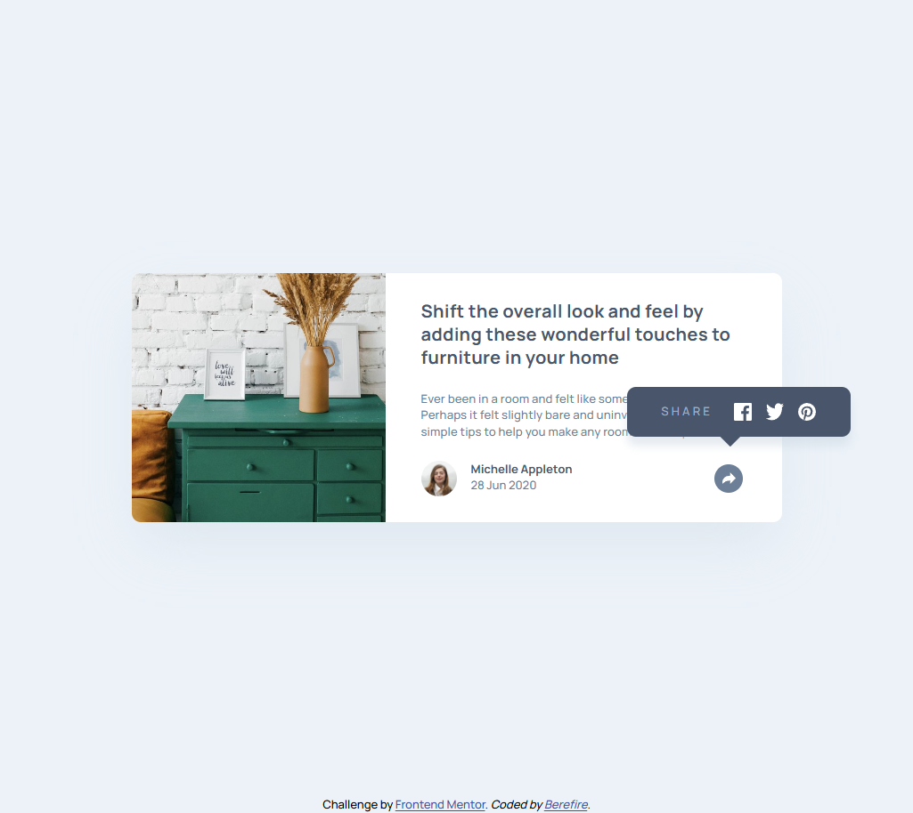

# Frontend Mentor - Article preview component solution


[](https://www.frontendmentor.io/)
[](https://code.visualstudio.com/)
[](https://git-scm.com/)
[](https://github.com/)


[](./assets/downloads/lighthouse-performance-report.pdf)

This is a solution to the [Article preview component challenge on Frontend Mentor](https://www.frontendmentor.io/challenges/article-preview-component-dYBN_pYFT). Frontend Mentor challenges help you improve your coding skills by building realistic projects.

## Table of contents

- [Overview](#-overview)
  - [The challenge](#-the-challenge)
  - [Screenshot](#-screenshot)
  - [Links](#-links)
- [My Process](#️-my-process)
  - [Architecture](#️-architecture)
  - [Design Tokens System](#-design-tokens-system)
  - [Responsive Image Strategy](#-responsive-image-strategy)
  - [Responsive Strategy](#-responsive-strategy)
  - [Built With](#-built-with)
  - [Performance Optimization](#-performance-optimization)
  - [Accessibility Considerations](#-accessibility-considerations)
  - [What I Reinforced](#-what-i-reinforced)
  - [Future Improvements](#-future-improvements)
  - [Useful Resources](#-useful-resources)
  - [AI Collaboration](#-ai-collaboration)
- [Author](#-author)
- [Acknowledgments](#-acknowledgments)

---

## 📋 Overview

This project recreates the Article Preview Component using semantic HTML, a scalable CSS architecture based on CUBE CSS principles, and a small interactive JavaScript component to control the share menu.

The main focus of this project was:

- Building a **clean CSS architecture**
- Creating a **design token system**
- Separating **layout primitives from components**
- Implementing a **responsive card layout**
- Adding an **accessible share interaction**
- Improving **Lighthouse accessibility and performance**

---

## 🎯 The challenge

Users should be able to:

- View the optimal layout depending on their device's screen size
- See hover states for interactive elements
- Toggle the share menu when clicking the share button

---

## 📸 Screenshot

| _Mobile Preview (375x914)_                     | _Mobile Active State Preview (375x914)_                                |
| ---------------------------------------------- | ---------------------------------------------------------------------- |
|      |    |
| _Tablet Preview (768x914)_                     | _Tablet Active State Preview (768x914)_                                |
|      |    |
| _Desktop Preview (1024x914)_                   | _Desktop Active State Preview (1024x914)_                              |
|    |  |

---

## 🔗 Links

- Solution URL:
- Live Site URL: [https://berefire.github.io/article-preview-component/](https://berefire.github.io/article-preview-component/)

---

## ⚙️ My Process

This project followed a **mobile-first approach**, progressively enhancing layout and component behavior across breakpoints.

The main goal was to build a **small but well-architected UI component** using a structured CSS architecture and accessible JavaScript interactions.

---

### 🏗️ Architecture

The project follows the **CUBE CSS methodology** for styling and a **modular JavaScript structure** for handling interactive behavior.

```html
css/
├── base/
│   ├── fonts.css
│   ├── reset.css
│   ├── global.css
│   └── tokens.css
│
├── composition/
│   ├── grid.css
│   ├── stack.css
│   ├── cluster.css
│   ├── box.css
│   └── cover.css
│
├── blocks/
│   ├── article-card.css
│   ├── attribution.css
│   ├── profile-date.css
│   ├── share-toast.css
│   └── share-button.css
│
├── utilities/
│   └── link.css
│
└── main.css

js/
├── modules/
│   └── share-toast.js
└── main.css
```

---

### Layer Responsibilities

#### Base

Contains foundational styles that apply globally.

Responsibilities:

- Design tokens
- CSS reset
- Global typography
- Font definitions

#### Composition

Provides layout primitives used across the project.

Responsibilities:

- Reusable layout patterns
- Spacing flow
- Layout composition without styling components

Examples:

- `stack` → vertical spacing
- `cluster` → horizontal grouping
- `grid` → layout distribution
- `box` → padding containers
- `cover` → vertical centering layouts

#### Blocks

Contains independent UI components.

Each block controls its own styling and internal behavior, without affecting layout primitives.

Components:

- `article-card` → main card container
- `attribution` → developer information block
- `profile-date` → author information block
- `share-button` → share interaction trigger
- `share-toast` → share menu panel

#### Utilities

Small helper classes for minor adjustments.

Example:

- `link` → link alignment and styling helpers

Utilities should be minimal and not contain layout logic.

#### JavaScript

JavaScript is structured in small focused modules to keep behavior separate from styling.

Structure:

```html
js/
├── modules/
│   └── share-toast.js
└── main.css
```

Responsibilities:

`main.js`

Application entry point.

- Initializes interactive components
- Imports feature modules
- Keeps the global script minimal

Example:

```javascript
import { initShare } from "./modules/share-toast.js";

initShare();
```

`share-toast.js`

Controls the **share interaction logic**.

Responsibilities:

- Toggle the share menu visibility
- Synchronize component state
- Manage accessibility attributes (`aria-expanded`)
- Handle keyboard interactions
- Close the menu when clicking outside
- Close the menu with the Escape key

This modular approach ensures:

- Behavior stays **isolated from layout**
- JavaScript remains **maintainable**
- Components can be **reused or extended**

#### Architectural Principles

This structure enforces several architectural rules:

- Layout primitives never contain component styles
- Components remain independent from layout logic
- Tokens drive visual consistency
- JavaScript behavior stays modular and predictable

This separation keeps the project **scalable and easier to maintain as complexity grows**.

---

### 🎨 Design Tokens System

The design system is powered by CSS custom properties.

#### Primitive tokens

These represent raw design values:

- spacing scale
- font sizes
- colors
- font weights

Example:

```css
:root {
  --space-200: 1rem;
  --space-300: 1.5rem;
  --fw-bold: 700;
}
```

### Semantic tokens

Semantic tokens represent UI roles instead of raw values.

Example:

```css
:root {
  --gap-article-card: var(--space-300);
  --fs-text-title: 1.25rem;
  --fc-text-body: hsl(214, 17%, 51%);
}
```

This improves maintainability and scalability.

---

### 🖼 Responsive Image Strategy

The card image adapts depending on layout orientation.

Key techniques used:

- `object-fit: cover`
- `object-position` adjustments
- container cropping through `overflow: hidden`
- flex-based layout resizing

This ensures the image maintains visual consistency across breakpoints.

---

### 📐 Responsive Strategy

The component follows a **mobile-first layout approach**.

- **Mobile:** Single column card layout.
- **Tablet:** Horizontal card layout using Flexbox with cropped image positioning.
- **Desktop:** Expanded layout with adjusted image cropping and improved text width control.

Media queries handle layout shifts while layout primitives maintain spacing consistency.

---

### 🛠 Built With

- Semantic HTML5
- CSS Custom Properties
- CUBE CSS architecture
- BEM naming methodology
- Flexbox
- Logical properties
- Mobile-first workflow
- Accessible JavaScript interactions
- Lighthouse optimization

---

### 🚀 Performance Optimization

Performance improvements included:

- Optimizing image rendering behavior
- Avoiding layout shifts
- Maintaining consistent aspect ratios
- Ensuring minimal JavaScript for interactions

The final component maintains a lightweight and efficient implementation.

---

### ♿ Accessibility Considerations

Accessibility improvements included:

- Semantic HTML structure
- Accessible button labeling
- `aria-expanded` synchronization
- Keyboard interaction support
- Escape key handling for closing the share menu
- Focus management when opening and closing the share panel

Example interaction logic:

```javascript
const isActive = shareToast.classList.toggle("is-active");

shareButton.classList.toggle("is-active", isActive);
shareButton.setAttribute("aria-expanded", String(isActive));

```

This keeps the visual state and accessibility state synchronized.

---

### 📚 What I Reinforced

- Structuring CSS using **CUBE CSS**
- Building reusable **design tokens**
- Separating layout and component responsibilities
- Implementing accessible interactive UI components
- Managing component state with minimal JavaScript
- Thinking architecturally rather than styling directly

---

### 🔮 Future Improvements

Possible improvements include:

- Introducing `@layer` organization
- Converting the share interaction into a reusable component pattern
- Adding automated accessibility testing
- Improving component reusability

---

### 📖 Useful resources

- [https://gwfh.mranftl.com/fonts](https://gwfh.mranftl.com/fonts) - great resource for self-hosted fonts
- [https://web.dev/learn/design](https://web.dev/learn/design) Good place to find any information about responsive design.

---

### 🤖 AI Collaboration

During this project, I used ChatGPT as a collaborative assistant to help analyze layout issues, refine accessibility improvements, and validate architectural decisions.

#### How I Used AI

- Debugging layout behavior in responsive breakpoints
- Refining token naming and CSS structure
- Improving accessibility in JavaScript interactions
- Understanding browser rendering behavior

#### What Worked Well

- AI helped explain browser layout mechanics
- It accelerated debugging complex CSS interactions
- It helped validate architectural approaches

#### What Didn’t Work Well

- Some early layout assumptions required validation in DevTools
- Visual adjustments still required manual inspection

AI served as a **supporting architectural assistant**, while all implementation and validation were handled manually.

---

## 👤 Author

- Frontend Mentor - [@berefire](https://www.frontendmentor.io/profile/berefire)
- GitHub - [@berefire](https://github.com/berefire)

---

## 🙏 Acknowledgments

Thanks to Frontend Mentor for providing challenges that encourage **architectural thinking and real-world UI development practices**, helping developers improve beyond simple layout replication.
